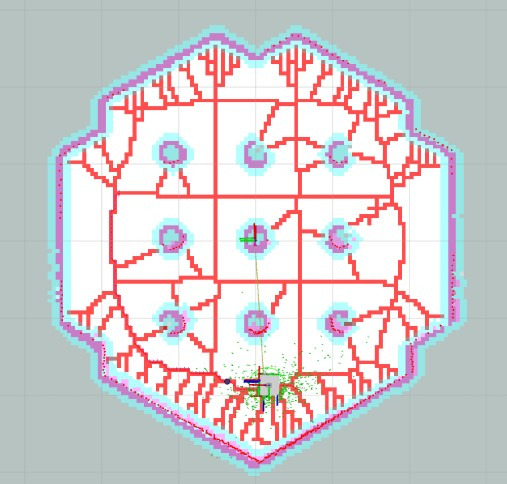

# Voronoi_Planner_ROS2
Based on ros2 humble and navigation2, this warehouse implements a global path planner based on Voronoi in nav2 to avoid obstacles, so that the robot can walk in a safer path.
<p align="center">
  
</p>

## CHANGE YOUR YAML
### CHANGE GLOBAL_COSTMAP
```bash
global_costmap:
  global_costmap:
    ros__parameters:
      update_frequency: 1.0 
      publish_frequency: 0.5 
      global_frame: map
      width: 6
      height: 6
      robot_base_frame: base_footprint   # base_link
      use_sim_time: True
      footprint: "[[0.310, -0.313], [-0.337, -0.313], [-0.337, 0.313], [0.310, 0.313]]"
      #robot_radius: 0.22
      resolution: 0.05
      track_unknown_space: true
      rolling_window: false 
      plugins: ["static_layer", "obstacle_layer", "inflation_layer" , "voronoi_layer"]
      #plugins: ["static_layer" , "voronoi_layer"]
      obstacle_layer:
        plugin: "nav2_costmap_2d::ObstacleLayer"
        enabled: True
        observation_sources: scan
        scan:
          topic: /scan
          max_obstacle_height: 2.0
          clearing: True
          marking: True
          data_type: "LaserScan"
          raytrace_max_range: 3.0
          raytrace_min_range: 0.0
          obstacle_max_range: 2.5
          obstacle_min_range: 0.0
      static_layer:
        plugin: "nav2_costmap_2d::StaticLayer"
        map_subscribe_transient_local: True
      inflation_layer:
        plugin: "nav2_costmap_2d::InflationLayer"
        cost_scaling_factor: 3.0 # 3.0
        inflation_radius: 0.1 # 0.01
        use_distance_cost: false
      voronoi_layer:
        plugin: "nav2_costmap_2d::VoronoiLayer"
      always_send_full_costmap: True
```

### CHANGE PLANNER_SERVER
```bash
planner_server:
  ros__parameters:
    expected_planner_frequency: 20.0
    use_sim_time: True
    planner_plugins: ["GridBased"]
    GridBased: 
      plugin: "nav2_voronoi_planner/VoronoiPlanner"
```

## HOW TO USE
Using the changed yaml file, just start as usual.
